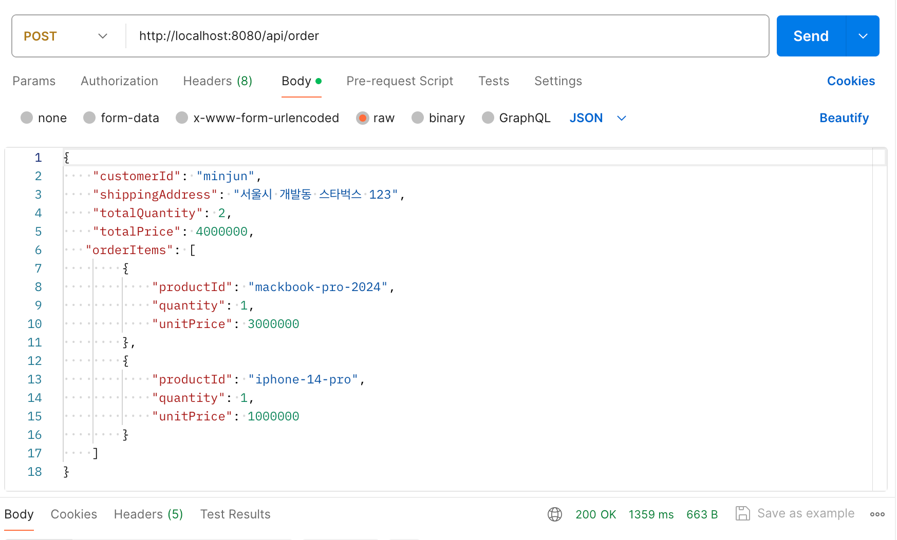
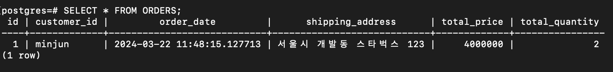
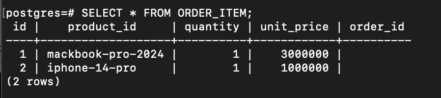
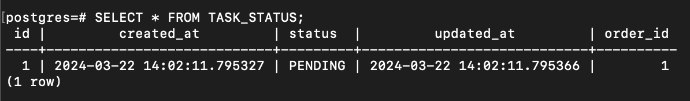
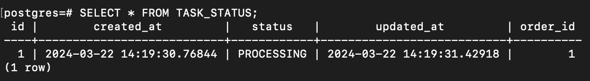
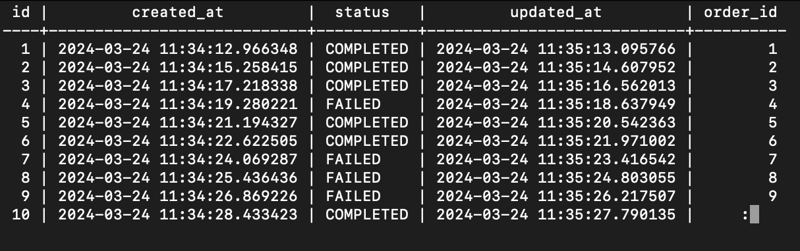

# Getting Started


### 1. 프로젝트 요약

* RabbitMQ를 활용하여 producer-consumer 구현
* Async 방식으로 주문 생성 및 주문 상태 변경
* TDD 방식으로 개발
* 하나의 프로젝트에서 dockerize를 통한 `RabbitMQ, Spring Boot, postgreSQL 서버`를 연동하여 테스트
* Refactoring 및 Clean Code 작성
* Design Patterns `Builder, Singleton, State, Facade, DI, Proxy`
<br>

### 2. 개발 환경

* Java 17
* Spring Boot 3.2.3
* RabbitMQ
* Docker
* PostgreSQL
<br>

### 3. Tables

- Order

  | Column          | Type           | Description |
  |-----------------|----------------|-------------|
  | id              | Long           | PK          |
  | customerId      | String         | 고객 ID       |
  | orderDate       | LocalDateTime  | 주문 날짜       |
  | shippingAddress | String         | 배송 주소       |
  | totalQuantity   | double         | 총 수량        |
  | totalPrice      | double         | 총 가격        |
  | orderItems      | List<OrderItem>| 주문 항목       |
  | taskStatus      | TaskStatus     | 작업 상태       |


- OrderItem

  | Column          | Type           | Description |
  |-----------------|----------------|-------------|
  | id              | Long           | PK          |
  | productId       | String         | 상품 ID       |
  | quantity        | double         | 수량         |
  | price           | double         | 가격         |
  | order           | Order          | 주문         |
 

- TaskStatus

  | Column    | Type           | Description |
  |-----------|----------------|-------------|
  | id        | Long           | PK          |
  | status    | String         | 상태          |
  | order     | Order          | 주문          |
  | createdAt | LocalDateTime          | 생성일시        |
  | updatedAt     | LocalDateTime          | 수정일시        |
<br>

### 3. Guides

#### - How to run the application
```angular2html
1] ./gradlew clean build // sleep을 사용하여 db 데이터 확인할때 -x test 추가(test코드 또한 sleep 발생)
2] docker-compose up --build
```
<br>

#### - API Endpoints

```
POST "/api/order"
body
{
    "customerId": "minjun",
    "shippingAddress": "서울시 개발동 스타벅스 123",
    "totalQuantity": 2,
    "totalPrice": 4000000,
    "orderItems": [
          {
              "productId": "mackbook-pro-2024",
              "quantity": 1,
              "unitPrice": 3000000
          },
          {
              "productId": "iphone-14-pro",
              "quantity": 1,
              "unitPrice": 1000000
          }
    ]
}
```
- postman UI (request and response)


<br><br>

#### - How to confirm database data 

#### 1. docker postgresql 접속 방법
```angular2html
1] docker-compose exec [서비스 이름] bash
2] psql -U [사용자 이름] -d [데이터베이스 이름]

이후 postgreSQL Query문을 통해 데이터 확인
```

#### 2. Order Table 조회 및 결과
```angular2html
SELECT * FROM ORDERS;
```


#### 3. OrderItem Table 조회 및 결과
```angular2html
SELECT * FROM ORDER_ITEM;
```


#### 4. TaskStatus Table 조회 및 결과
```angular2html
성공한 TASK_STATUS: PENDDING > PROCESSING > COMPLETED
실패한 TASK_STATUS: PENDDING > PROCESSING > FAILED
SELECT * FROM TASK_STATUS;
```
- PENDING

- PROCESSING

- COMPLETED and FAILED (성공과 실패는 70:30 비율로 나타나게 Random하게 생성)



### Reference Links

* [RabbitMQ](https://www.rabbitmq.com/)
* [ChatGPT](https://chat.openai.com/)
